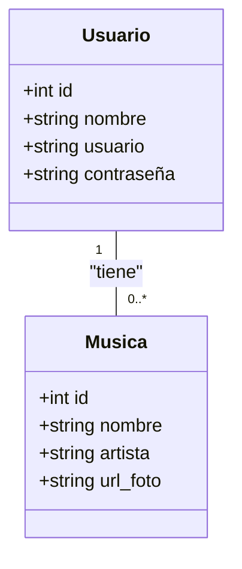
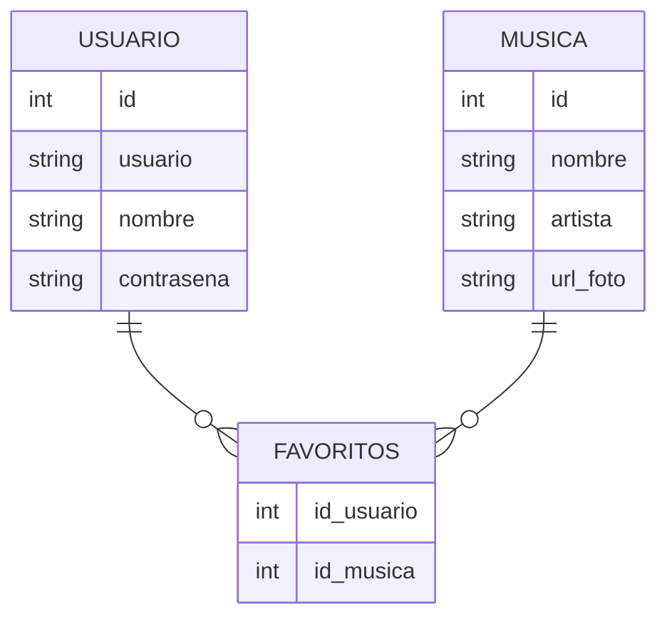
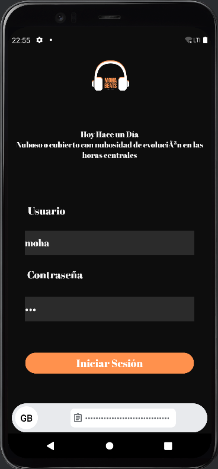
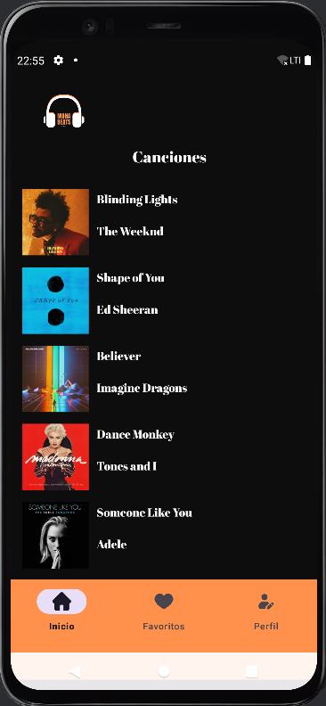
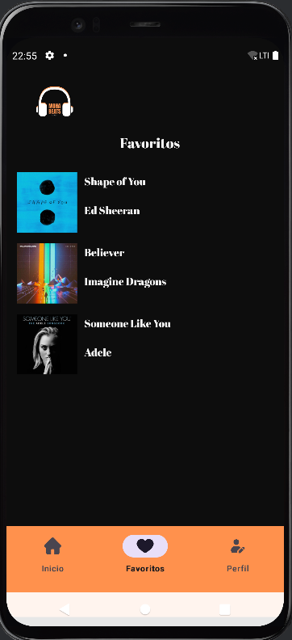
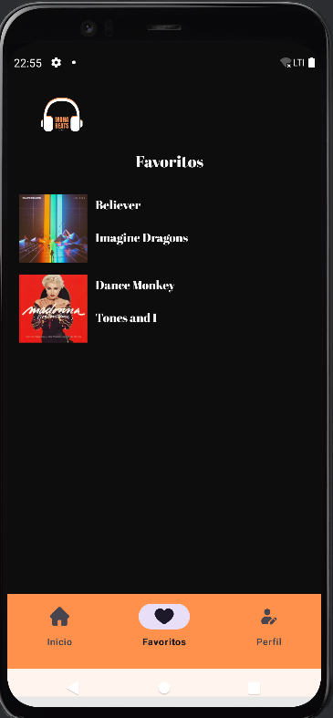
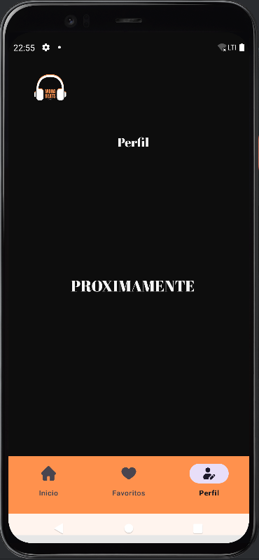

[GITHUB](https://github.com/rifi45/MohaBeats)

# Importante
Al iniciar la aplicación, puedes acceder con uno de estos dos usuarios. 
usuario: "moha" o "ali"
contraseña para los dos: "123"
## Moha Beats
La aplicacion consiste en un resproductor de musica el cual tiene unas canciones, usuarios, y las canciones favoritas de un usuario. 
El usuario que inicia sesion puede consultar las canciones que hay, y sus favoritas.

## Diseño
**Diagmara de clases**


**Modelo Entidades**


## Elementos Utilizados
- **Arquitectura Clean**
- **MVVM**
- **RetroFit**
- **Glide** Librería
- **Dagger Hilt**
- **Room**
- **ViewBinding**
- **Fragmentos**
- **Petición de Permisos**
## Capturas de la ejecucion
Al iniciar la aplicacion el usuario tendrá que iniciar sesión


Aqui aparecen las canciones un usuario.


Aqui estan las canciones favoritas de moha


Aqui estan las canciones favoritas de ali


Esta pagina de perfil no es funcional


## Informácion Técnica
```
Android Studio Ladybug | 2024.2.1 Patch 2
Runtime version: 21.0.3+-12282718-b509.11 amd64
VM: OpenJDK 64-Bit Server VM by JetBrains s.r.o.
Windows 11.0
kotlin = "2.0.21"
```

Emulador: Pixel 4 API 30

## innovaciones y problemas
Para el tema de la innovaciones, he metido una dependencia glide para poder cargar imagenes de la nube, las imagenes de cada pelicula son recuperadas por una url.
problemas: el problema que he tenido que es a la hora de implemetar el ViewModel en los fragmentos el viewModels() me salía en rojo, tuve que hacerlo de otra manera utilizando el get. Los Toasts no me funcionan no sé porque pero los sigo teniendo ahí.

## Conclusiones
Realizar la aplicación siguiendo una arquitectura es mucho mas eficaz y ordenado.
Es dificil de asimilarlo al principio, pero luego se entiende muy bien, sobre todo si te ha tocado hacer cambios importantes en la aplicacion ahi es cuando se ve el verdadero valor de una arquitectura que separa todo.